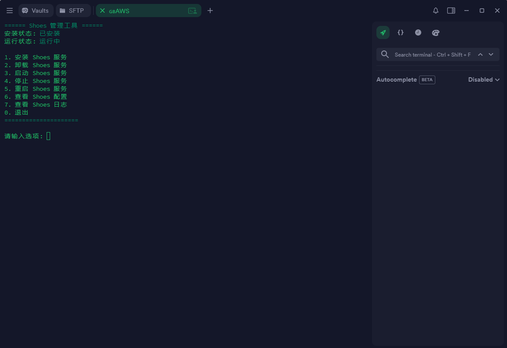

## 终端预览



## 一键脚本
```
bash <(curl -fsSL shoes-black-one.vercel.app)
```
## Shoes — 轻量化、高性能的代理服务框架优势

轻量化：单文件可执行程序，无额外依赖，部署极其简单。

高性能：基于 Rust 开发，低延迟、高并发、资源占用极低。

跨平台：提供 GNU 与 MUSL 版本，可在多数 Linux 环境直接运行。

配置简洁：采用 YAML 格式，结构清晰，容易上手。

稳定可靠：MUSL 静态版本不依赖 glibc，兼容旧系统，不会出现 GLIBC 错误。

Shoes 是一个现代化、高性能的代理服务框架，旨在提供更快、更安全、更易扩展的网络传输体验。
得益于 Rust 语言的高性能和内存安全性，Shoes 能在极低资源消耗下运行并提供顶级的代理能力。
